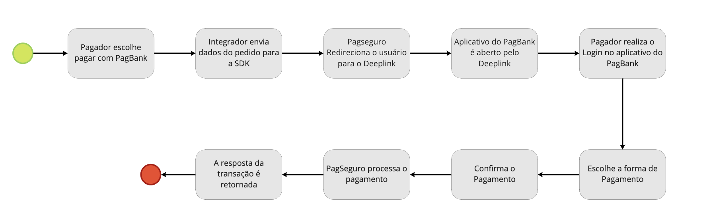

# Pagar com PagBank iOS SDK
---
## Introdução
O Pagar com PagBank é o produto do PagSeguro que permite aos vendedores utilizar o app PagBank como método de pagamento no checkout do seu próprio aplicativo. Este produto confere mais segurança aos vendedores devido aos padrões de validação de conta e cartões de crédito, adotados pelo PagBank. 

---
## SDK

A SDK disponibiliza um botão de pagamentos que facilita a integração do Merchant, através de suas credenciais pode enviar os dados do seu pedido e nossa SDK irá realizar a integração com nossos serviços. 

___
## Conceitos Básicos

Antes de fazer uso da biblioteca é importante que o desenvolvedor realize alguns procedimentos básicos, além de assimilar alguns conceitos importantes para o correto funcionamento de sua aplicação. É necessário ter em mãos o token da conta PagSeguro que será configurado como vendedor (Seller), tal token pode ser obtido no ibanking do PagSeguro.

___
## Históricos de Versão
* 0.0.1 : **Versão inicial publicada** - 25/05/2021
* 0.0.2 : **Versão atualizada publicada** - 24/01/2022

---
## Pré-requisitos
* Possuir uma conta PagSeguro.
* Para utilizar o Pagar com PagBank, é necessário que o seu aplicativo seja desenvolvido em Swift.

---
## Integrando o Pagar com PagBank
Para integrar a biblioteca (SDK) em seu projeto, siga os passos abaixo.
1. Faça o download da versão mais recente da biblioteca. 
2. Abra o projeto do seu aplicativo pelo Xcode.
3. Arraste o arquivo `pagpay.framework` para dentro do seu projeto. Selecione `Copy itens if need`, `Created group`, `Add to target`.

4. Selecione seu projeto no Project Navigator e, em seguida, selecione seu targert no menu Targets. Depois vá em `frameworks, Libaries, and Embedded Content` e garanta que seu framework esteja `Embed & Sing`

___
## Receba as notificações de pagamento
O PagSeguro poderá enviar notificações via webhook para seu ambiente sempre que um evento (uma mudança de status de transação) acontecer, possibilitando a automação de seus processos de gestão de vendas.

Acesse o link para mais informações: https://dev.pagseguro.uol.com.br/reference/charge-webhook

___
## Credenciais de Autenticação
As soluções públicas do PagSeguro requerem autenticação e através dela identificamos e autorizamos o integrador a utilizar nossas APIs e seus recursos, bem como eventuais configurações adicionais.

* Primeiro passo - Ter uma conta PagSeguro

Para criar uma conta no nosso ambiente de Sandbox, acesse o link: https://acesso.pagseguro.uol.com.br/sandbox

* Segundo passo - Criar uma Aplicação para utilizar o Pagar com PagBank.

Acesse o link: https://dev.pagseguro.uol.com.br/reference/connect-create-client

___
## Ambientes disponíveis 

* Produção - https://api.pagseguro.com/
* Sandbox  - https://sandbox.api.pagseguro.com/

___
## Formas de Integração:

Se você deseja integrar com o Produto via API, segue os links abaixo, caso contrário siga a documentação do Github.

* Criando um pedido via API Order com Deeplink: https://dev.pagseguro.uol.com.br/reference/criando-um-pedido-com-deeplink-pagar-com-pagbank
* Simulando um pagamento de pedido em sandbox: https://dev.pagseguro.uol.com.br/reference/pagando-um-pedido-com-deeplink-em-sandbox

___
## Instalação
Saiba como utilizar o Pagar com PagBank no seu aplicativo iOS.

* [Como usar os botões](docs/buttons.md)
* [Como criar uma requisição de pagamento](docs/requisicao.md)

___
## Como devolver/cancelar um pagamento recebido?
Acessando o iBanking no link https://acesso.pagseguro.uol.com.br/, você pode através do menu "Extratos e Relatórios", acessar a opção Extrato de Transações identificar a transação que deseja devolver/cancelar, ao acessar os detalhes da transação a opção de devolver/cancelar estará disponível.

___
## Fluxo

