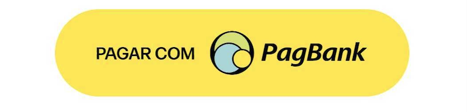
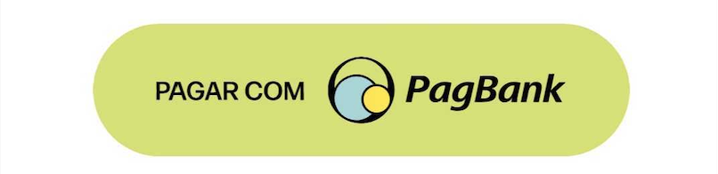
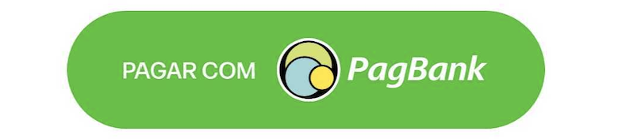
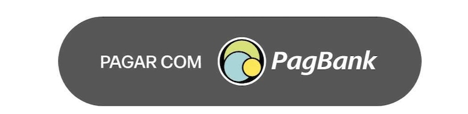
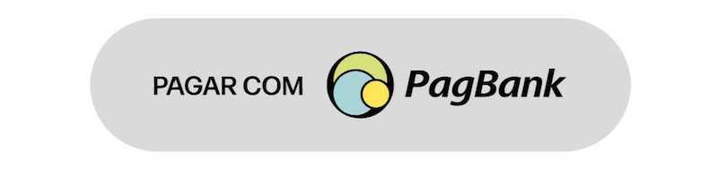

## Como usar

---

O botão pode ser implementado via `Storyboard` ou `view code`

### Via Storyboard

1 - Primeiramente você deve realizar a conexão do botão do seu storyboard com a seu viewController, isso irá gerar um IBOutlet e o tipo dele deve ser `PagPayPaymentButton` como mostra o código abaixo

```swift
@IBOutlet weak var pagPayButton: PagPayPaymentButton!
```

2 - No método de `viewDidLoad` da sua viewController deve ser chamado o método de setup de configuração do layout

```swift
pagPayButton.setupLightGreenTheme()
```


### Via view code

1 - No seu viewController basta instânciar a classe `PagPayPaymentButton` passando qual estilo de layout deseja para o botão no construtor da classe

```swift
let yellowPagPayButton = PagPayPaymentButton(frame: .zero, theme: .yellow)
```

2 - Depois disso no método `viewDidLoad` adicione o botão na sua view e configure as constraints de acordo com a sua necessidade

```swift
view.addSubview(yellowPagPayButton)

// Exemplo
yellowPagPayButton.translatesAutoresizingMaskIntoConstraints = false
yellowPagPayButton.leftAnchor.constraint(equalTo: view.leftAnchor, constant: 16.0).isActive = true
yellowPagPayButton.rightAnchor.constraint(equalTo: view.rightAnchor, constant: -16.0).isActive = true
yellowPagPayButton.heightAnchor.constraint(equalToConstant: 58.0).isActive = true
yellowPagPayButton.bottomAnchor.constraint(equalTo: view.bottomAnchor, constant: -150.0).isActive = true

```

<br>

### Na SDK são disponibilizadas cinco opções de botões que podem ser utilizadas:

<br>

#### Yellow


```swift
// view code
let yellowPagPayButton = PagPayPaymentButton(frame: .zero, theme: .yellow)

// storyboard
pagPayButtonOutlet.setupYellowTheme()
```

#### Light Green


```swift
// view code
let lightGreenPagPayButton = PagPayPaymentButton(frame: .zero, theme: .lightGreen)

// storyboard
pagPayButton.setupLightGreenTheme()
```

#### Green


```swift
// view code
let greenPagPayButton = PagPayPaymentButton(frame: .zero, theme: .green)

// storyboard
pagPayButton.setupGreenTheme()
```

#### Dark


```swift
// view code
let darkPagPayButton = PagPayPaymentButton(frame: .zero, theme: .dark)

// storyboard
pagPayButton.setupDarkTheme()
```

#### Gray


```swift
// view code
let lightPagPayButton = PagPayPaymentButton(frame: .zero, theme: .gray)

// storyboard
pagPayButton.setupGrayTheme()
```
